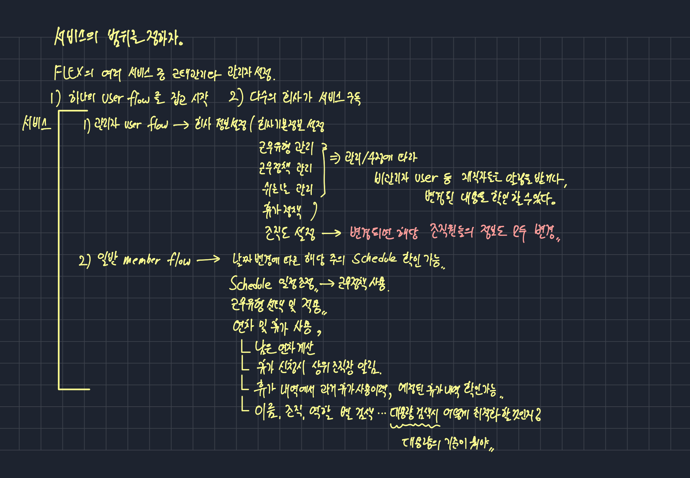

OOP TRAINING - FLEX Team Clone

1. 근무유형 생성 
- 일 근무시간 설정 (ex 8hr)
- 일 휴게시간 설정
- 출근 가능 시간 범위 설정
- 일하는 날 / 유급 휴일 설정
- 주 근무시간 검증(40시간 이상 이하 체크)

2. 구성원 추가
- 필수 정보(이름, 이메일, 입사일, 근무유형)
- 선택 정보(직무, 조직(조직장), 사번, 직급, 직책)
- 요청정보 템플릿
- 이메일 발송

3. 신규 입사자 가입시,
- 기본 정보(이름, 소개, 주민번호, 휴대전화, 주소) 입력
- 급여 정보 (은행명, 계좌번호) 입력
- 경력 ( 전직장 명, 직무, 입사-퇴사일, 계약유형) 입력, 추가 가능
- 학력 ( 학교명, 전공, 입학-졸업년월, 졸업구분)
- 기본서류준비 : 주민등본(필수), 가족관계증명서(옵셔널), 건강보험자격득실확인서(옵셔널)

4. 근무 
- 당일 기준으로 해당 주(week) 보여줘야한다.

4-1. 구성원 스케쥴
- TBD

5. 연차 - 하루종일 / 오전반차 / 오후반 / 1일 이상 신 / 사

### 사람 - 직무입력
- 고려사항 : 다수의 사람이 공통된 직무 (ex 백엔드개발) 를 가지고 있을 때 직무 명을 변경해야한다면, 해당 직무명을 가진 모두에게 변경사항이 적용돼야한다.
- 메시지 보내면 곧 바로 렌더링이 안되네

#### 내 스케쥴
- 주간 스케쥴 보여준다.
- 해당 사용자에게 할당된 근무 유형에 따라, 주간 스케쥴을 보여준다
- 스케쥴을 선택하면, 근무 방식을 바꿀 수 있다 (시간, 연차, 외근, 원격근무 등)
- 근무 스케쥴을 삭제할 수도 있다. -> `개인의 근무스케쥴을 어떤 방식으로 저장해야할지 고민해야 한다.`
- 매 주마다 동일한 근무유형을 스케쥴로 뿌려주면 된다. 문제는 각 일자마다 수정사항이 생길수 있다는 점인데, 이렇게 되면 하나의 통일된 스케쥴을 뿌려주는 형태가 아니게 된다.
- -> 처음엔 공통된 스케쥴을 뿌려주되, 업데이트 치면 수정된 형태로 저장하면 되는 거 아닌가?

#### Q. 고려사항
- 아침 시간에 접속 몰릴 것으로 예상, 특정시간에 트래픽 몰린다면 어떻게 처리하면 좋을까?
- 사용자 로그인 시 회사 고유 아이디넘버로 검증 -> 자신이 속한 회사 화면 보여줘야한다. 
- 동일 컴퓨터에서 두개의 아이디로 로그인 할 시 어떻게 대응할 것인지. 
- 근태관리 더존과의 차이점도 비교해보면 재밌을듯 .

#### 궁금증
- 스프링 없는 자바에선, 클래스가 곧 모델의 역할 아닌가?

### 어떤 기능을 구현할지 산정하기

